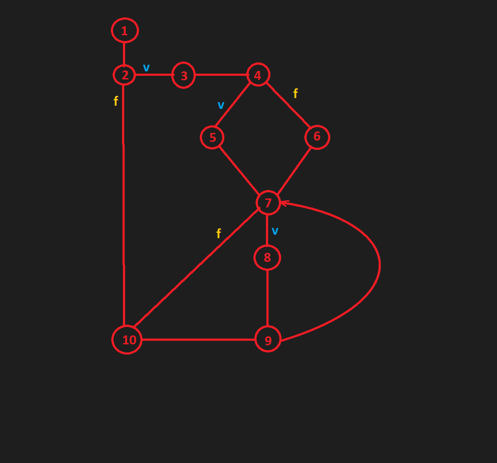
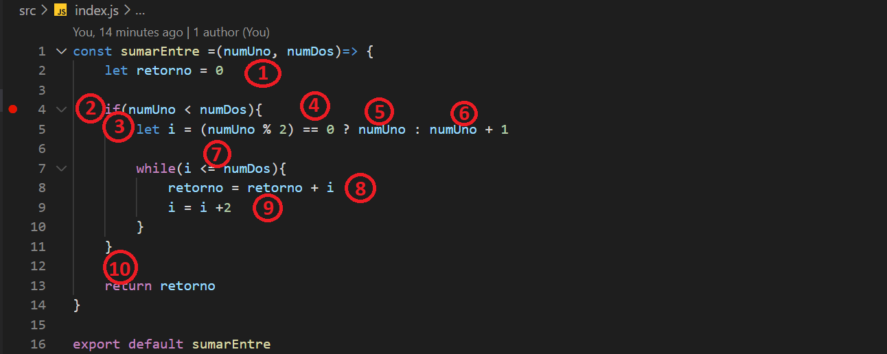
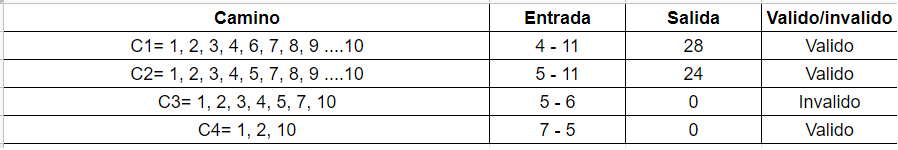

# Test unitarios NodeJs UPE
## ***Ejercicio con grafos*** 
## **-Grafo**

## **-Código**

## **-Complejidad Ciclomatica**
CC = (11-10)+2

CC = 3
## **-Conjunto de caminos basicos**
- C1= 1,2,3,4,6,7,8,9 ....10
- C2= 1,2,3,4,5,7,8,9 ....10
- C3= 1,2,3,4,5,7,10
- C4= 1,2,10
## **-Input/output**

## -**Instalación**
1- Requiere NodeJs, para instalarlo vayan a la pagina oficial de node y bájenlo
[Node.js](https://nodejs.org/)

2- una vez instalado, descarguen este repo y ábranlo con el editor de código a gusto, si es visualCode mejor
[VistualCode](https://code.visualstudio.com/)

3- una vez abierto el proyecto, podemos usar la terminal integrada del code para correr los siguiente comandos

npm install 

o

npm i

con esto conseguiremos que se nos bajen los módulos de node

4- ya con los módulos de node instalados para ejecutar los test, pondremos en la terminal

npm test

y se nos estará ejecutando nuestros test unitarios

